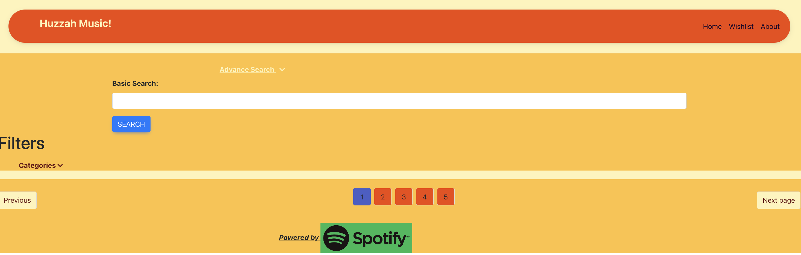
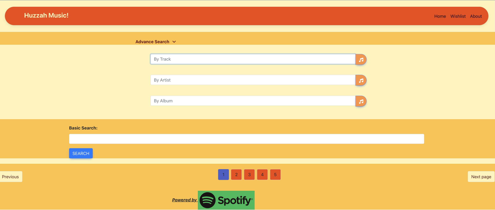
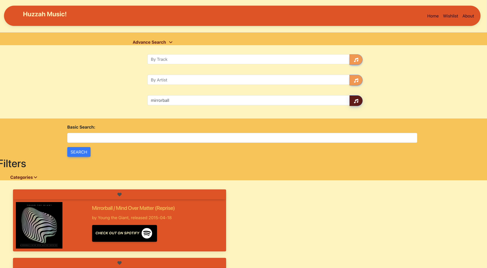
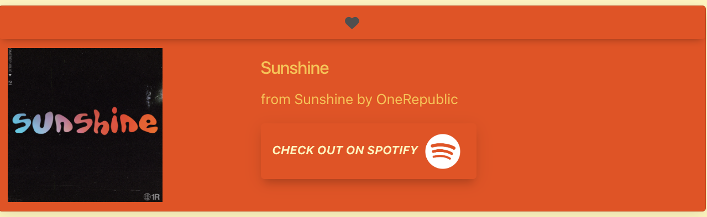
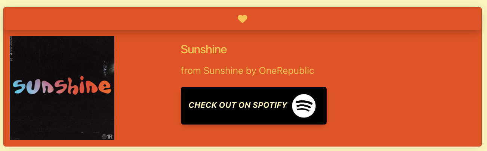

# Huzzah Music

## Description

This application serves as a music search and repository. Using Spotify API and Discogs API, this website seeks to provide music information matching the search criteria (general) in the search bar or in the advanced search fields (music items: track, artist, album, and genre).
These searches will then populate a list of music items matching these criteria. These items will be available to add to a wishlist, and the detailed information including possibility to play the item(s) will be available upon clicking on the "Play on Spotify" button. Furthermore, information about acquiring the music through an online merchant should be found through Spotify or Discogs.

More information and local merchant options to follow once API functionality is assured.

### User Story

As a consumer,
I want to find music matching my interests and add them to a wishlist or find some way to purchase them.

### Acceptance Criteria

Given that I wish to find music,
When I type a track, artist, album, or other option in a search bar,
Then I want to find a corresponding album to buy.
When I click on a music listing,
Then I am presented with the details of, and the location, where an album can be found.
When I click the heart button,
Then I can save a listing to my wishlist.
When I click share,
Then I can share my wishlist with my friends on various social media.
When I click on a listing,
Then I can see from where the album may be bought or played.

## Usage

//Deployed application website '<https://aedelfrid.github.io/Huzzah-Music/>'
//Application GitHub repository '<https://github.com/aedelfrid/Huzzah-Music>'

Upon accessing the website application, the user can search in the general search box, which will look up tracks, artists, albums, and playlists. One can also use the Advanced Search drop-down to search specifically for a track, an artist, OR an album. The page also contains a (so far) non-functional filter, that would allow for a genre search.

The search then uses Spotify's API to generate cards holding information about the music item searched. 
Both the general and advanced searches will then dynamically generate HTML content through Javascript on which the fetched info will be displayed.

Each music item displayed will provide a link to the relevant Spotify page where the user can listen to the track, artist, album, or playlist chosen.

Ideally, music items populated in this list will be saved by clicking the heart icon in the corresponding entry, the saved data should then be displayed on the wishlist page in the same form. This wishlist will be available on a separate page and reachable through an ever-present link in the navbar.

Here are screenshots of the current state:
Basic View:

SearchTrack:

Search Album:

Go to Spotify:

Save as favorite:

## Roadmap

These following items are unimplemented ideas, as such, they are future goals in the development of this app:

We are still working on a Filter function narrowing down the results by genre, using a dropdown menu to choose the genre/category.

The ability to save items to local storage and to display them on a wishlist page is not complete. Ideally, there would be a dropdown menu or accessible modals to display the wishlist/favourites list according to all search types: tracks, artists, albums, genres. In addition, it could also be possible to create playlists on Huzzah Music that could be played on or through Spotify.

The Discogs API has not been implemented, but would permit the user to find musical items available on the marketplace. The possibility of adding YouTube API to complement Spotify exists, though their terms and conditions may prohibit this.

From the wishlist page, it should be possible to share music information to friends on various social media platforms. (Choose one main platform with which to begin.)

## Credits

Code developed (in alphabetical order) by Alexander McKinnon (github.com/aedelfrid), Benoît DesRoches (github.com/benhwaet), and Neerajaa Narayanan (github.com/hineeraja).
Bootstrap, Bulma, MongoDB, and Popperframeworks used (and modified to fit).

## License

MIT License, see repository for full license file.
